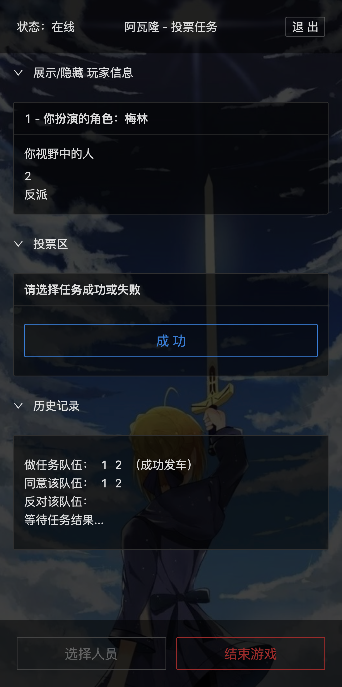

# Avalon Serverless Version (Hasura Backend)

This is a new project similar to [Avalon Nodejs Ver](https://github.com/hlhr202/avalon-game). Since this version uses Hasura as backend, you can deploy the frontend on any edge runtime (eg. Vercel)

The frontend uses GraphQL subscription to get realtime updates from Hasura server so that we can easily synchronize states across multiple browsers

## Screenshot




---

## Deployment pre-request

-   Hasura
    -   [Hasura cloud](https://cloud.hasura.io/) or
    -   Self hosted with PostgreSQL Database
-   Node.js 16+
-   pnpm

---

## Prepare

1. Create a Hasura instance, either from server or self hosted

2. Install [Hasura CLI](https://hasura.io/docs/latest/hasura-cli/install-hasura-cli/)

3. Initialize Hasura instance:

    - Change _hasura/config.yaml_ to your hasura endpoint/admin-secret in config.yaml

        ```yaml
        version: 3
        endpoint: Your Hasura Endpoint # eg. https://xxx.hasura.app
        admin_secret: Your Hasura Admin Secret
        metadata_directory: metadata
        actions:
            kind: synchronous
            handler_webhook_baseurl: http://localhost:3000
        ```

    - Run hasura migration and initialization

        ```bash
        cd ./hasura
        hasura migration apply # apply scheme/db migrations
        hasura metadata apply # apply hasura metadata
        hasura seed apply # apply initial data seed
        ```

    - Ensure you have configure _HASURA_GRAPHQL_UNAUTHORIZED_ROLE_ environment variable as _player_ in your hasura cloud dashboard or docker runtime

4. prepare .env file under workspace root folder for nodejs usage

    ```properties
    uri="Your Hasura GraphQL Endpoint" # without protocol, eg: xxx.hasura.app/v1/graphql
    hasura_admin_secret="Your Hasura Admin Secret"
    ```

---

## Development

-   Run dev script

    ```bash
    pnpm i
    pnpm dev
    ```

-   Generate GraphQL type

    ```bash
    pnpm gen
    ```

---

## Deployment

-   Make sure your environment variables equivalent to .env file is configured in your server runtime

    (eg. Config Environment Variables on Vercel Dashboard)

-   Run script

    ```bash
    pnpm i
    pnpm build
    pnpm start
    ```

## Todo

-   [ ] Internationalization - 50%
